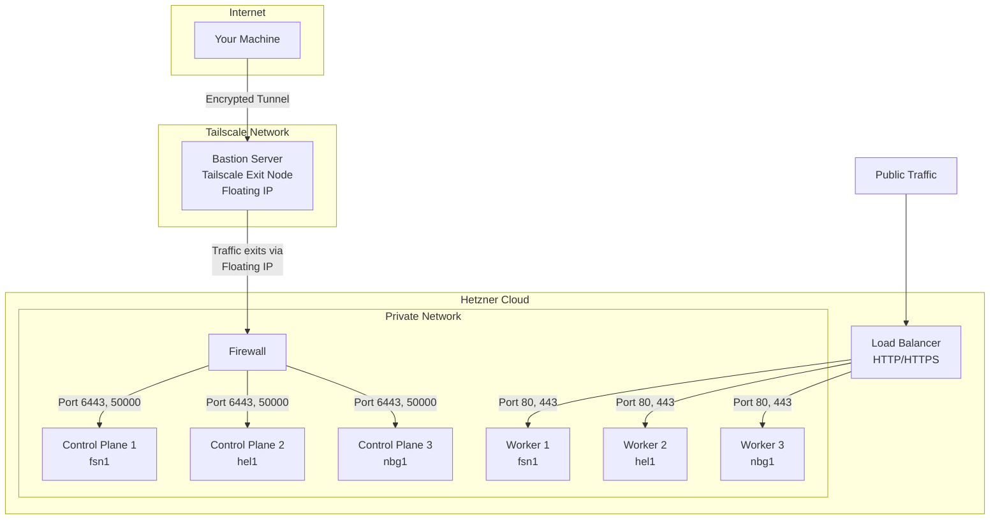

# Talos Kubernetes Cluster on Hetzner Cloud

A private, production-ready Kubernetes cluster using [Talos Linux](https://www.talos.dev/) on [Hetzner Cloud](https://www.hetzner.com/cloud), managed with [Pulumi](https://www.pulumi.com/).

## Overview

This project deploys a **bare bone Kubernetes cluster** with:

- **3 control plane nodes** spread across datacenters (fsn1, hel1, nbg1) for high availability (configurable)
- **3 worker nodes** for running workloads (configurable)
- **Private API access** via Tailscale exit node (no public exposure)
- **Cilium CNI** with Gateway API support (replaces kube-proxy)
- **Hetzner integrations** for load balancers and persistent volumes

This is intentionally minimal infrastructure. After deployment, we recommend adding GitOps tooling and additional components (see [Next Steps](#next-steps)).

## Architecture



### Why This Architecture?

**Bastion with Tailscale Exit Node**: The Kubernetes and Talos APIs are not exposed to the internet. Instead, a bastion server runs Tailscale as an exit node with a static Floating IP. When you route traffic through this exit node, your requests appear to come from the Floating IP, which is the only IP allowed through the firewall. This provides:

- No public API exposure (reduced attack surface)
- Static IP for firewall rules (predictable access control)
- Encrypted access via Tailscale (zero-trust networking)
- Direct node access via Tailscale MagicDNS for debugging

## Prerequisites

- [Pulumi CLI](https://www.pulumi.com/docs/install/) and a Pulumi account
- [Node.js](https://nodejs.org/) 18+
- [Tailscale](https://tailscale.com/) account and installed client
- [Hetzner Cloud](https://www.hetzner.com/cloud) account with API token
- [Packer](https://www.packer.io/) (for building Talos images)
- `kubectl` and `talosctl` CLI tools

## Setup

### 1. Build the Talos Image

Create a Hetzner snapshot with Talos Linux:

```bash
export HCLOUD_TOKEN="your-hetzner-api-token"
export TALOS_VERSION="v1.12.2"

./scripts/build-image.sh
```

Note the snapshot ID from the output, needed for the `configurations:snapshotId` config.

### 2. Configure the Stack

```bash
# Install dependencies
pnpm install --frozen-lockfile

# Login to Pulumi (if not already)
pulumi login

# Select or create the dev stack
pulumi stack select dev

# Set required secrets (make any other config changes here)
pulumi config set hcloud:token --secret <your-hetzner-token>
pulumi config set tailscale:authKey --secret <your-tailscale-auth-key>
pulumi config set tailscale:tailnet <your-tailnet>.ts.net
pulumi config set configurations:snapshotId <snapshot-id-from-step-1>
```

### 3. Phase 1 - Deploy Bastion

Deploy the bastion server first (cluster deployment disabled):

```bash
pulumi config set configurations:deployCluster false
pulumi up
```

After deployment:

1. Go to [Tailscale Admin Console](https://login.tailscale.com/admin/machines)
2. Find `bastion-dev` and enable "Use as exit node" in route settings
3. Verify the bastion is working:

```bash
# Enable exit node
tailscale set --exit-node=bastion-dev

# Verify your IP matches the Floating IP
curl -s ifconfig.me
# Should match: pulumi stack output bastionFloatingIp

# Disable exit node for now
tailscale set --exit-node=
```

### 4. Phase 2 - Deploy Cluster

With the exit node ready, deploy the full cluster:

```bash
# Enable exit node (required for cluster deployment)
tailscale set --exit-node=bastion-dev

# Enable cluster deployment
pulumi config set configurations:deployCluster true

# When you first deploy the cluster, allow initial provisioning,
# this is mainly needed for proper bootstrapping of the cluster.
pulumi config set configurations:allowInitialProvisioning true

# Deploy the cluster
pulumi up

# It's good to wait for 2-3 minutes after the cluster is deployed
# before locking down the firewall.

# Lock down firewall (disable initial provisioning mode)
pulumi config set configurations:allowInitialProvisioning false

# Deploy the cluster
pulumi up
```

### 5. Access the Cluster

```bash
# Ensure exit node is enabled
tailscale set --exit-node=bastion-dev

# Get talosconfig (needed for talosctl)
pulumi stack output talosconfig --show-secrets > talosconfig.yaml


# Get kubeconfig (needed for kubectl)
pulumi stack output kubeconfig --show-secrets > kubeconfig.yaml
export KUBECONFIG=./kubeconfig.yaml

# Verify cluster access
kubectl get nodes
kubectl get pods -A
```

## Daily Usage

```bash
# Before running kubectl/pulumi commands
tailscale set --exit-node=bastion-dev

# After you're done
tailscale set --exit-node=
```

Nodes are also accessible directly via Tailscale MagicDNS:

```bash
talosctl -n controlplane-01-dev.<your-tailnet>.ts.net version
```

## Components

| Component      | Version | Purpose                                  |
|----------------|---------|------------------------------------------|
| Talos Linux    | v1.12.2 | Immutable, secure Kubernetes OS          |
| Kubernetes     | v1.34.1 | Container orchestration                  |
| Cilium         | v1.18.6 | CNI, kube-proxy replacement, Gateway API |
| Hetzner CCM    | v1.29.2 | Cloud controller (node lifecycle, LBs)   |
| Hetzner CSI    | v2.18.3 | Persistent volume provisioning           |
| Metrics Server | v3.12.2 | Resource metrics for HPA and kubectl top |

## Project Structure

```text
├── src/
│   ├── index.ts                # Entry point
│   ├── config.ts               # Configuration loader
│   ├── types.ts                # TypeScript type definitions
│   └── components/
│       ├── bastion.ts          # Bastion server + Floating IP
│       ├── cluster.ts          # TalosCluster orchestration
│       ├── cilium.ts           # Cilium CNI deployment
│       ├── control-plane-lb.ts # Internal HA load balancer
│       ├── firewall.ts         # Hetzner firewall rules
│       ├── hetzner-core.ts     # CCM, CSI, Metrics Server
│       ├── loadbalancer.ts     # Worker ingress load balancer
│       ├── network.ts          # Private network
│       ├── server.ts           # Hetzner server provisioning
│       └── talos.ts            # Talos secrets and machine config
├── scripts/
│   ├── bastion-cloudinit.sh    # Bastion initialization script
│   └── build-image.sh          # Packer build helper
├── hcloud.pkr.hcl              # Packer template for Talos image
├── Pulumi.yaml                 # Pulumi project definition
└── Pulumi.dev.yaml             # Dev stack configuration
```

## Next Steps

This cluster is intentionally bare bone. For production use, we recommend adding:

| Component          | Purpose                                        | Link                                                              |
|--------------------|------------------------------------------------|-------------------------------------------------------------------|
| **FluxCD**         | GitOps continuous delivery                     | [fluxcd.io](https://fluxcd.io/)                                   |
| **Sealed Secrets** | Encrypted secrets in Git                       | [sealed-secrets](https://github.com/bitnami-labs/sealed-secrets)  |
| **cert-manager**   | Automatic TLS certificates                     | [cert-manager.io](https://cert-manager.io/)                       |
| **external-dns**   | Automatic DNS record management                | [external-dns](https://github.com/kubernetes-sigs/external-dns)   |
| **CNPG**           | PostgreSQL operator                            | [cloudnative-pg.io](https://cloudnative-pg.io/)                   |
| **Traefik**        | Ingress controller (or use Cilium Gateway API) | [traefik.io](https://traefik.io/)                                 |

A typical setup flow:

1. Install FluxCD and point it to your GitOps repository
2. Add Sealed Secrets for managing secrets in Git
3. Deploy cert-manager with Let's Encrypt for TLS
4. Configure external-dns for automatic DNS updates
5. Add your application workloads

## Troubleshooting

**Exit node not working:**

```bash
# Check if bastion is listed
tailscale exit-node list

# If not listed, approve in Tailscale admin console
# https://login.tailscale.com/admin/machines → bastion-dev → Enable exit node
```

**Cannot connect to cluster APIs:**

```bash
# Verify exit node is active
tailscale status | grep "exit node"

# Verify your IP is the Floating IP
curl -s ifconfig.me
# Should match: pulumi stack output bastionFloatingIp
```

**Deployment hangs:**

1. Ensure exit node is enabled: `tailscale set --exit-node=bastion-dev`
2. Verify IP matches Floating IP: `curl -s ifconfig.me`
3. Check firewall rules in Hetzner console

## Contributions

Contributions are welcome! Please feel free to submit a Pull Request.

## License

Released under the MIT License. See LICENSE for details.
